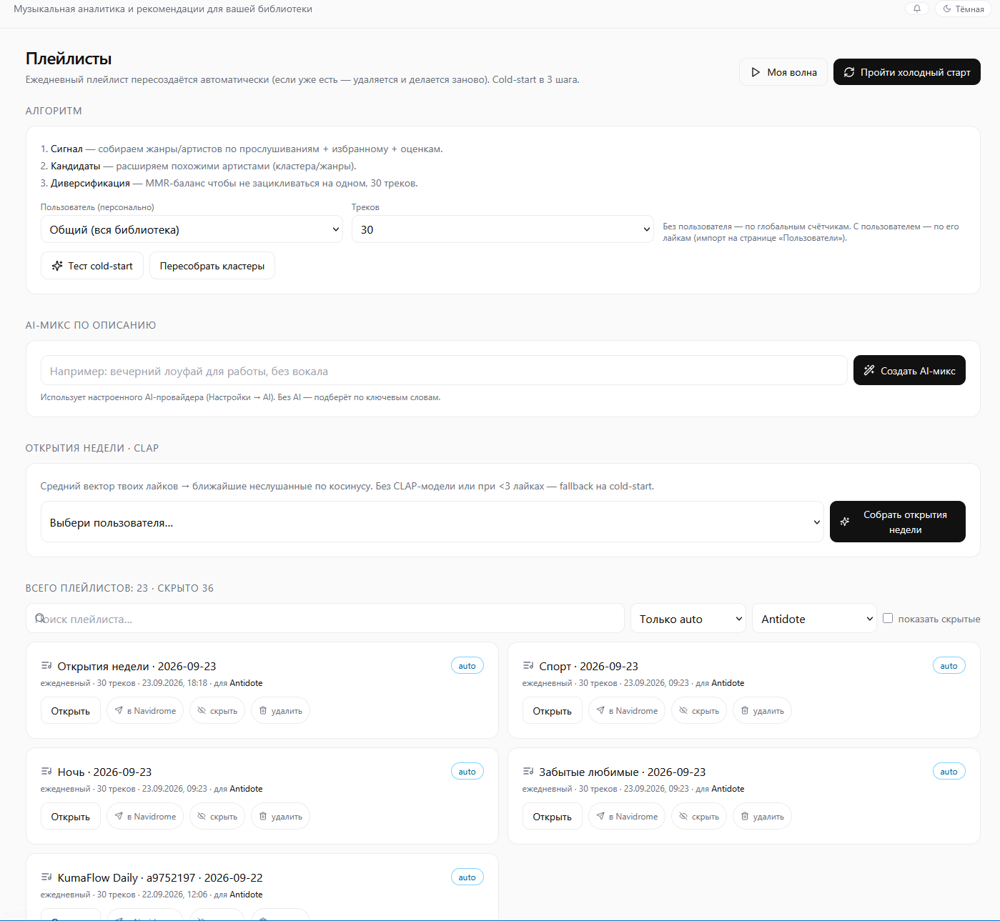
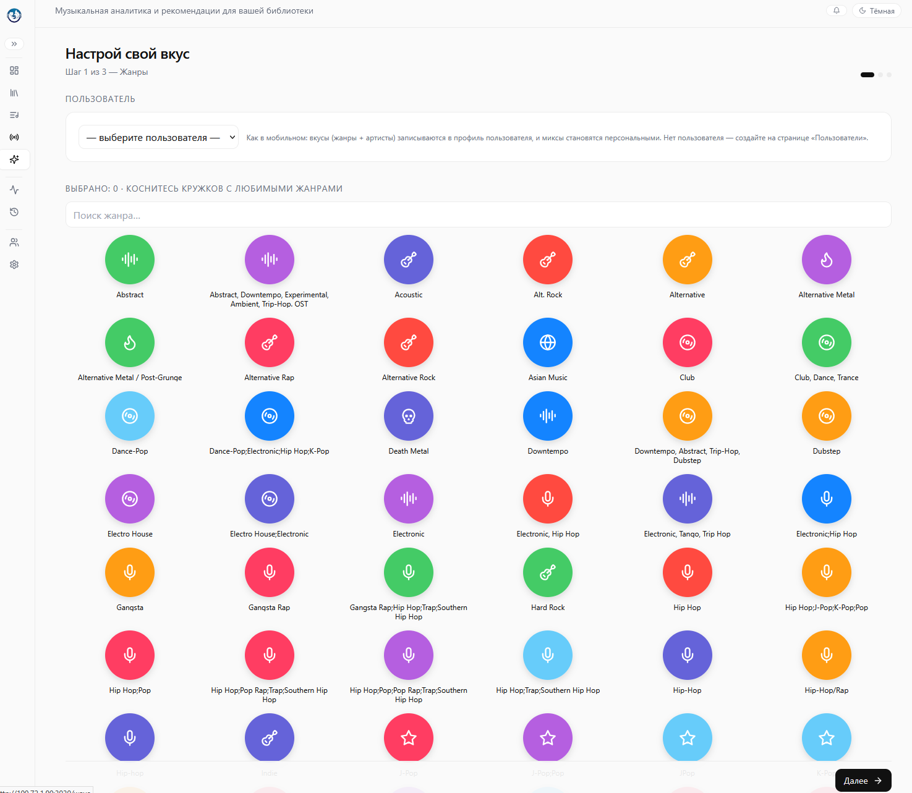
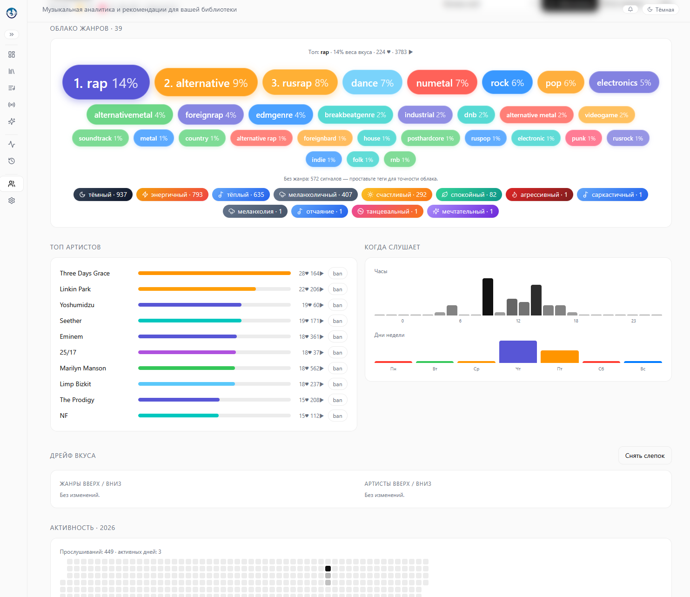
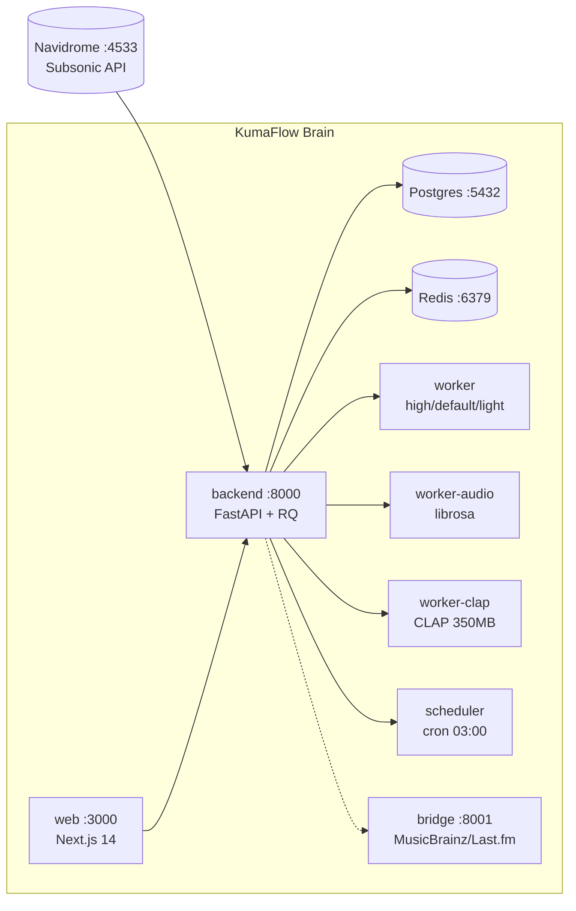

<div align="center">


# 🐻‍❄️ KumaFlow Brain

**Self-hosted music intelligence layer for your media server**

*Sonic-анализ · CLAP-поиск по смыслу · Ежедневные плейлисты · Моя волна*

[](https://github.com/mrSaT13/kumaflow-brain/actions)
[](https://github.com/mrSaT13/kumaflow-brain/pkgs/container/kumaflow-brain-backend)
[](https://github.com/mrSaT13/kumaflow-brain/pkgs/container/kumaflow-brain-web)
[](LICENSE)
[](server/)
[](web/)

[🚀 Быстрый старт](#-быстрый-старт-за-5-минут) · [✨ Фичи](#-что-умеет) · [📸 Скриншоты](#-скриншоты) · [🏗 Архитектура](#-архитектура) · [📖 API](#-api) · [🛠 Разработка](#-локальная-разработка)

</div>

> 🧩 **Экосистема KumaFlow:** 🧠 **Brain** (этот репозиторий — серверный анализ и рекомендации) + 🎵 **[KumaFlow Player](https://github.com/mrSaT13/kumaflow)** — десктоп / web-плеер для Navidrome/Subsonic (Windows · macOS · Linux · Docker, Electron-форк Aonsoku с Vibe Similarity и Smart Auto-DJ).

---

> Индексирует библиотеку **Navidrome / Jellyfin / Emby / Lyrion**, делает настоящий sonic-анализ аудиофайлов (темп, тональность, энергия, танцевальность, настроение — движок `librosa`), подтягивает тексты, ищет по смыслу через **CLAP**, обогащает через **Yandex Music / Last.fm** и генерирует ежедневные плейлисты per-user — как в мобильном KumaFlow.

## ✨ Что умеет

| | Возможность |
|---|---|
| 🎧 | **Sonic-анализ** — tempo, key, energy, danceability, mood. Файлы берутся с диска worker'а (`/music`) или стримом из Navidrome через Subsonic `download` |
| 🔍 | **CLAP-поиск по смыслу** — `laion/larger_clap_general` 512-dim (~350 МБ), `mode: embedding` (Voyager HNSW) или fallback `keyword` |
| 🌊 | **Моя волна** — динамическая очередь `POST /api/wave/continue` + live-очередь телефона на странице `/wave`, сиды, автобан артиста после 3 дизлайков |
| 📻 | **Daily-плейлисты per-user** — холодный старт (`0.6 floor`), AI-генератор, оркестратор волной, крон `0 3 * * *` через APScheduler |
| 👤 | **Taste engine** — профиль вкусов, история, коллаборативные рекомендации, sync с мобильным клиентом, Vault (Fernet-шифр паролей) |
| 📝 | **Тексты песен** — открытые провайдеры (lyrics.ovh, musixmatch) + кэш |
| 🖼 | **Обложки как на мобиле** — size-aware, `ETag` + `Cache-Control 7d`, LRU до 2 ГБ, prefetch батчами по 8 |
| 🤖 | **Ollama Cloud parity** — `api/chat` + Bearer, `/api/tags`, pull модели из UI |
| 🌉 | **Мост метаданных** — MusicBrainz + Last.fm (опциональный сервис `:8001`) |
| 💾 | **Ночные бэкапы** — `pg_dump` в `./backups`, ротация 14 дней |

Веб-UI (`:3000`): библиотека · трек · волна · плейлисты · история · cold-start · сканы · пользователи · Wrapped · настройки.

## 📸 Скриншоты

| Плейлисты: cold-start + AI-микс + CLAP-открытия | Холодный старт: жанры | Профиль вкуса: облако жанров + топ артистов |
|---|---|---|
|  |  |  |


## 🏗 Архитектура



| Сервис | Образ | Назначение |
|---|---|---|
| `backend` | `ghcr.io/mrsat13/kumaflow-brain-backend:latest` | FastAPI + SQLAlchemy + RQ (Python 3.11) |
| `web` | `ghcr.io/mrsat13/kumaflow-brain-web:latest` | Next.js 14 App Router + TS + Tailwind |
| `bridge` | `ghcr.io/mrsat13/kumaflow-brain-bridge:latest` | Метаданные, профиль `bridge` (опционально) |
| `worker` / `worker-audio` / `worker-clap` / `scheduler` / `backup` | backend / postgres | Очереди RQ, аудио-анализ, эмбеддинги, крон, бэкапы |

Порты по умолчанию: `3000` — веб · `8000` — API · `8001` — мост · `5432` — Postgres · `6379` — Redis · `4533` — Navidrome.

## 🚀 Быстрый старт за 5 минут

```bash
git clone https://github.com/mrSaT13/kumaflow-brain.git kumaflow && cd kumaflow
nano docker-compose.yml   # заменить все CHANGE_ME_*: пароль PG, BRAIN_API_TOKEN (openssl rand -hex 32), URL Navidrome
docker compose pull && docker compose up -d
curl -s http://localhost:8000/api/health   # {"status":"ok"}
```

Открой: веб — `http://<сервер>:3000` · API — `http://<сервер>:8000/api/health` · доки — `http://<сервер>:8000/api/docs`.

<details>
<summary><b>🎧 Sonic-анализ: как worker добирается до mp3</b></summary>

<br/>

По умолчанию монтировать ничего не нужно: worker тянет каждый трек стримом из Navidrome через Subsonic `download` во временный файл, считает признаки через librosa и удаляет файл. Медленнее, но работает из коробки.

Быстрый вариант — примонтировать в `worker` и `worker-audio` ту же папку музыки, что у Navidrome (только чтение), в тот же путь `/music`:

```yaml
environment:
  MUSIC_DIR: /music
volumes:
  - /путь/к/музыке/на/хосте:/music:ro
```

Анализ идёт по всем непроанализированным трекам (`ANALYSIS_MAX_TRACKS_PER_RUN=0` — все; `200` у audio-worker — чанками с resume). Прогресс — в логах задачи (Задачи и логи → логи).

</details>

<details>
<summary><b>🌉 Опционально: мост метаданных (MusicBrainz / Last.fm)</b></summary>

```bash
docker compose --profile bridge up -d
```

1. Открой `http://<сервер>:3000/settings`
2. Раздел «Мост метаданных»: URL `http://bridge:8001` → «Проверить мост» → «Сохранить»
3. `LASTFM_API_KEY` (https://www.last.fm/api/account/create) — в секции `bridge` в compose; без него мост работает только через MusicBrainz

Проверка: `curl -s http://localhost:8001/api/bridge/health`

</details>

<details>
<summary><b>🧠 CLAP из коробки: текст + аудио (запечено в образ)</b></summary>

Модель `Xenova/clap-htsat-unfused` quantized (~165МБ) запечена в backend-образ при сборке —
качать ничего не надо, `worker-clap` стартует сам. Поиск по смыслу и аудио-гибрид
в похожих работают сразу; без них был бы fallback на cold-start/keyword.

</details>

## 📖 API

Полная спецификация: `http://<сервер>:8000/api/docs`. Ключевое:

| Группа | Endpoints |
|---|---|
| 🌊 Волна | `POST /api/wave/continue` · `GET /api/wave/seeds` · `POST /api/wave/publish` · `GET /api/wave/live?user_id=` |
| 👤 Пользователи | `POST /api/users/` · `POST /api/users/by-credentials` · `POST /api/users/{id}/sync-from-mobile` · `POST /api/users/{id}/events` · `GET /api/users/{id}/profile` |
| 📻 Плейлисты | `POST /api/playlists/generate-daily` · `POST /api/playlists/ai-generate` · `GET /api/analysis/cold-start?user_id=&n=30` |
| 🔍 Анализ | `POST /api/analysis/search-by-text` (`embedding`/`keyword`) · `POST /api/scan/clap` |
| 📚 Библиотека | `/api/library/*` · `/api/tracks/*` · `/api/covers/*` · `/api/lyrics/*` · `/api/collab/*` · `/api/cron` · `/api/settings/*` |

## 🛠 Локальная разработка

**Backend** (по умолчанию sqlite, Postgres не нужен):

```bash
cd server
python -m venv .venv && .\.venv\Scripts\Activate.ps1  # Linux/macOS: source .venv/bin/activate
pip install -r requirements.txt
cp .env.example .env
uvicorn app.main:app --reload --port 8000
# вторым терминалом:
python -m app.workers.rq_worker
```

**Frontend:**

```bash
cd web
npm install
npm run dev    # http://localhost:3000
```

**Всё в Docker из исходников:**

```bash
cp server/.env.example server/.env
cd deploy && docker compose up -d --build
```

### Структура

```
.
├── docker-compose.yml        # ДЕПЛОЙ: готовые образы из GHCR (без сборки)
├── .env.example              # пример env для всего стека
├── deploy/
│   ├── docker-compose.yml    # локальная разработка: сборка из исходников
│   ├── Dockerfile.server     # backend + workers
│   └── Dockerfile.web        # frontend
├── server/                   # FastAPI + SQLAlchemy + RQ (Python 3.11)
├── web/                      # Next.js 14 + TypeScript + TailwindCSS
├── bridge/                   # мост метаданных (MusicBrainz / Last.fm)
└── .github/workflows/docker-publish.yml  # CI: сборка и пуш образов в GHCR
```

### Переменные окружения

| Файл | Назначение |
|---|---|
| `.env` (корень) | весь стек `docker-compose.yml` на сервере |
| `server/.env` | локальный запуск без Docker |
| `web/.env.local` | локальный `npm run dev` (обычно не нужен — работает прокси `/api → backend`) |

Ключевые: `MUTAGEN_WRITEBACK` · `YANDEX_MUSIC_TOKEN/THROTTLE` · `CLAP_ENABLED` · `ANALYSIS_MAX_TRACKS_PER_RUN=0` · `TASTE_VAULT_KEY` · `BRAIN_API_TOKEN`. В контейнерах Postgres принудительно (`DB_URL_OVERRIDE=""`), sqlite в Docker не используется.

### Полезное

```bash
docker compose logs -f backend worker web   # логи
docker compose ps                           # статус
docker compose down                         # остановить (данные в volumes живы)
docker compose down -v                      # остановить И удалить данные (осторожно!)
```

## 📄 Лицензия

Copyright (C) 2026 mrSaT13.

Проект под **GNU Affero General Public License v3.0 (AGPL-3.0)** — см. [LICENSE](LICENSE).
